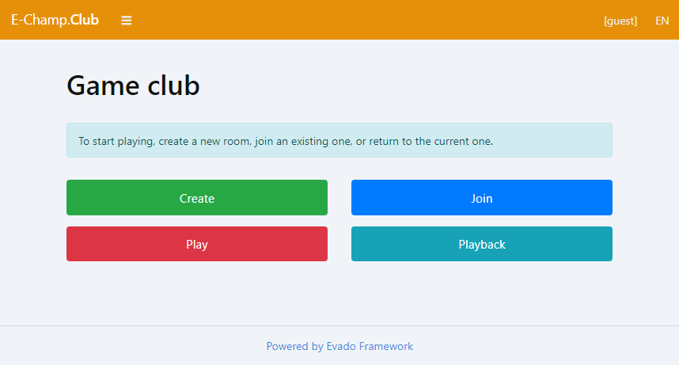

# E-Champ

### A server-side platform for turn-based online games.

The E-Champ includes games as separate npm modules.
Each game implements backend and frontend parts in the platform standard.

Players can be both remote users and bots.
The E-Champ supports multiple implementations of computer opponent behaviors,
which are also created as separate modules.

## Ready to run

- [E-Champ App](https://github.com/mkhorin/e-champ-app)

Built on [Evado Declarative Framework](https://github.com/mkhorin/evado).